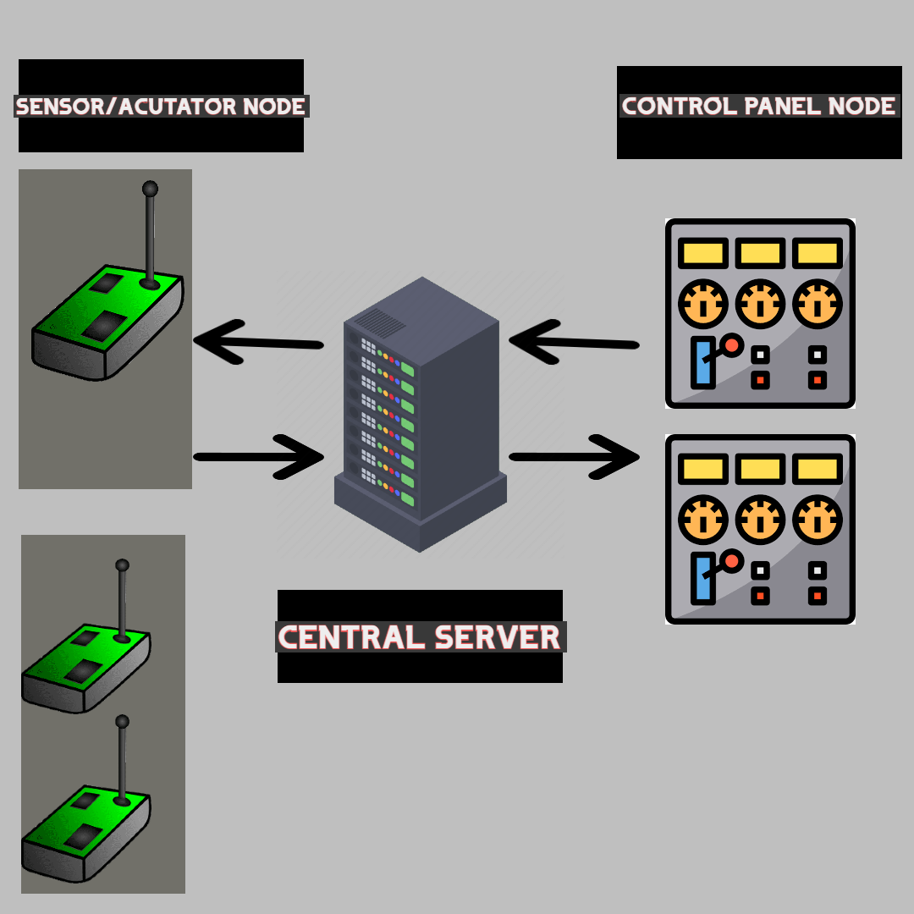

# Communication protocol

This document describes the protocol used for communication between the different nodes of the
distributed application.

## Terminology

* Sensor - a device which senses the environment and describes it with a value (an integer value in
  the context of this project). Examples: temperature sensor, humidity sensor.
* Actuator - a device which can influence the environment. Examples: a fan, a window opener/closer,
  door opener/closer, heater.
* Sensor and actuator node - a computer which has direct access to a set of sensors, a set of
  actuators and is connected to the Internet.
* Control-panel node - a device connected to the Internet which visualizes status of sensor and
  actuator nodes and sends control commands to them.
* Graphical User Interface (GUI) - A graphical interface where users of the system can interact with
  it.

## The underlying transport protocol
We opt for the TCP transport-layer protocol due to its reliability. This choice is driven by the protocol's ability to incorporate error-checking mechanisms and facilitate the retransmission of lost packets; which could lead to a suboptimal control of the farming enviornment.

## The architecture

TODO - show the general architecture of your network. Which part is a server? Who are clients? 
Do you have one or several servers? Perhaps include a picture here. 

**Server**: Central server managing communication between control-panel nodes and sensor/actuator nodes.

**Clients**: Control-panel nodes and sensor/actuator nodes.

|  |
|:--:|
| *The network architecture* |

## The flow of information and events

TODO - describe what each network node does and when. Some periodic events? Some reaction on 
incoming packets? Perhaps split into several subsections, where each subsection describes one 
node type (For example: one subsection for sensor/actuator nodes, one for control panel nodes).

### Sensor/Actuator Nodes
**Periodic Events**: Broadcast sensor data every 5 seconds.

**Incoming Packets**: React to control commands from the server.

### Control-panel Nodes
**Periodic Events**: Update GUI with sensor data.

**Incoming Packets**: Receive sensor data, send control commands.

## Connection and state

Our communication protocol is connection-oriented, and stateless. This makes it more scalable and reliable

**Connection-Oriented**: Protocol establishes and maintains connections.

**Stateless**: Scalable and reliable without relying on stored connection states.

## Types, constants

TODO - Do you have some specific value types you use in several messages? They you can describe 
them here.

## Message format

TODO - describe the general format of all messages. Then describe specific format for each 
message type in your protocol.

### Error messages

TODO - describe the possible error messages that nodes can send in your system.

**Possible Errors**: Connection failure, invalid command, sensor failure.

**Error Format**: Include error code and description in error messages.

## An example scenario

TODO - describe a typical scenario. How would it look like from communication perspective? When 
are connections established? Which packets are sent? How do nodes react on the packets? An 
example scenario could be as follows:
1. A sensor node with ID=1 is started. It has a temperature sensor, two humidity sensors. It can
   also open a window.
2. A sensor node with ID=2 is started. It has a single temperature sensor and can control two fans
   and a heater.
3. A control panel node is started.
4. Another control panel node is started.
5. A sensor node with ID=3 is started. It has a two temperature sensors and no actuators.
6. After 5 seconds all three sensor/actuator nodes broadcast their sensor data.
7. The user of the first-control panel presses on the button "ON" for the first fan of
   sensor/actuator node with ID=2.
8. The user of the second control-panel node presses on the button "turn off all actuators".

## Reliability and security

TODO - describe the reliability and security mechanisms your solution supports.

**Reliability Mechanisms**: TCP's inherent error-checking and retransmission.

**Security Mechanisms**: Data encryption for sensitive information exchange. Additional security protocols can be implemented as needed.